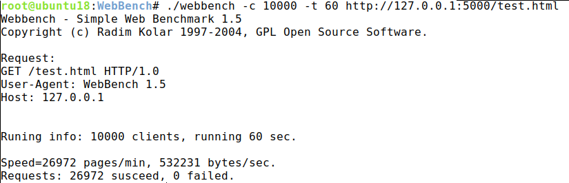

# CPPWebServer

## Introduction:

**CPPWebServer** is a simply web server based on **epoll** and **threadpool** in CPP which use GET/POST method to server static content(text, HTML, PNG, etc) and dynamic content(by running CGI programs). You can read [RFC2616](https://tools.ietf.org/html/rfc2616) to understand **Hypertext Transfer Protocol**(HTTP) messages format.

CPPWebServer provides following functions:
- provide GET/POST method to view static content and run cgi script.
- provide lots of functions to handle HTTP error.

## Usage:

You can add **config item** to `config.ini` to control CPPWebServer. There are several argument option:
```
# port : integer, server port number, default 5000
port : 5000

# isDaemon : yes/no, run mode, default no
isDaemon : no

# htdocPath : string, root path of htdocpath, default .
htdocPath : .
```

## Build & Compile:

CPPWebServer **just for linux**, to test a simply demo, you can run:

```bash
mkdir build && cd build
cmake ../ -G "{your_prefer_compiler}"
make
./CPPWebServer
```
Just enjoy it!

## Test
CPPwebserver is tested by webbench.
```
webbench -c {client_num} -t 60 http://127.0.0.1:5000/test.html
```



## Examples:
Based on CPPWebServer, HelloWorld and MessageBoard websites are built, you can change `htdocPath `in `config.ini` to test them.

### MessageBoard
**MessageBoard** use **sqlite3** to save message items, you can run `sudo apt install sqlite3 libsqlite3-dev` to install sqlite3:

### HelloWorld


## Bug

If you find some bugs, please email to bihuchao@qq.com.
    
-EOF-

